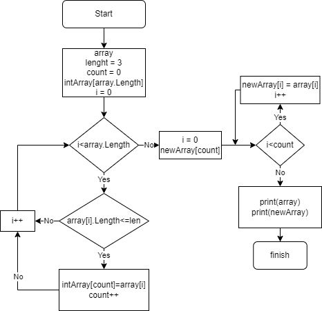

## Итоговая проверочная работа

Буду надеяться что данная работа будет оценена на отлично!!!

## Поставленные задачи 

1. Создать репозиторий на GitHub
2. Нарисовать блок-схему алгоритма(можно обойтись блок-схемой основной содержательной части, если вы выделяете ее в отдельный метод)
3. Снабдить репозиторий оформленным текстовым описанием решения(Readme.md)
4. написать программу, решающую поставленную задачу 
5. Использовать контроль версий в работе над этим небольшим проектом

**Задача:** Написать программу, которая из имеющегося массива строк формирует массив из строк, длина которых меньше либо равна 3 символа. Первоначальный массив можно ввести с клавиатуры, либо задать на старте выполнение алгоритма. При решении не рекомендуется пользоваться коллекциями, лучше обойтись исключительными массивами. 

**Задача:** Написать программу, которая из имеющегося массива строк формирует массив из строк, длина которых меньше либо равна 3 символа. Первоначальный массив можно ввести с клавиатуры, либо задать на старте выполнение алгоритма. При решении не рекомендуется пользоваться коллекциями, лучше обойтись исключительными массивами. 

## 2. Нарисовать блок-схему алгоритма

## 3. Снабдить репозиторий оформленным текстовым описанием решения

1. Принимаем массив введенный вручную или автоматически
2. Создаем промежуточный массив с длиной вводимого массива
3. Определяем элементы, длина которых меньше или равна 3, и считаем их количество (к)
4. Создаем новый массив с длинной равной кол-ву элементов (к) и вписываем в него элементы промежуточного массива без пустых элементов 
5. Выводим первоначальный и новый массивы 